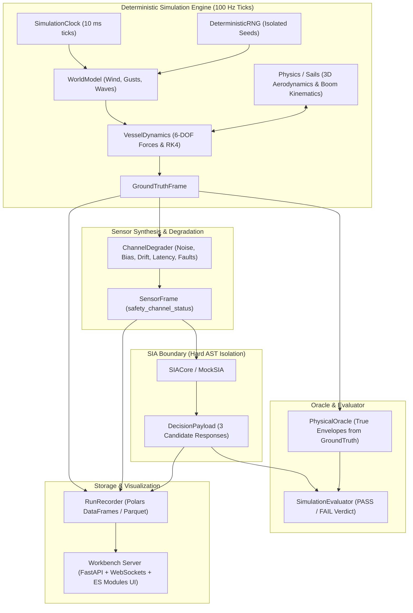

# Architecture Overview

**Analysis Date:** 2026-09-17

## System Architecture

SIA Simulation implements a strictly decoupled, deterministic, discrete-time 100 Hz simulation architecture.

---

## Key Modules & Layer Responsibilities

### 1. `core` (`src/sia_sim/core/`)
- `clock.py`: Deterministic integer millisecond clock advancing in discrete 10 ms steps (100 Hz).
- `rng.py`: Per-subsystem isolated PRNG streams with deterministic seed derivations.

### 2. `contracts` (`src/sia_sim/contracts/`)
- `data.py`: `SensorFrame`, `GroundTruthFrame`, `IMUData`, `WindData`, `GPSData`, `ActuatorData`.
- `evaluation.py`: `CandidateResponse`, `DecisionPayload`, `RiskAssessment`, `EvaluationResult`.
- `scenario.py`: `Scenario`, `VesselConfig`, `EnvironmentConfig`, `SimulationConfig`, `EventConfig`.
- `sails.py`: `EffectiveSailDefinition`, `SailAdvisoryPayload`, `SailSuitability`.

### 3. `physics` (`src/sia_sim/physics/`)
- `world.py`: Environmental state generator and event dispatcher.
- `dynamics.py`: 6-DOF rigid-body equations of motion (surge, sway, heave, roll, pitch, yaw).
- `forces.py`: Hydrodynamic hull resistance, keel lift, rudder forces, wave excitation moments.
- `environment.py`: Wind gust generators, JONSWAP/Pierson-Moskowitz wave spectrums, slamming impacts.
- `integrator.py`: Fixed-step RK4 and symplectic Euler numerical integrators.
- `sails/`: Standalone 3D sail aerodynamics, dynamic boom angle kinematics, 3D Center of Effort, slot effect, downwind blanketing.

### 4. `sensors` (`src/sia_sim/sensors/`)
- `pipeline.py`: Base sensor pipeline orchestrator.
- `degradation.py`: Configurable Gaussian noise, bias, drift, latency queue, and failure mode decorators.
- `imu.py`, `gps.py`, `wind.py`, `actuator.py`: Individual sensor synthesizers.

### 5. `sia` (`src/sia_sim/sia/`)
- `protocol.py`: `SIACore` abstract interface.
- `mock_sia.py`: Deterministic rule-based mock implementation generating 3 candidate responses and resolving conflicts.

### 6. `evaluator` (`src/sia_sim/evaluator/`)
- `oracle.py`: Ground-truth physical safety oracle computing hazard onset and recovery timing.
- `evaluator.py`: Objective comparison of SIA decisions against Oracle targets to produce PASS/FAIL verdicts.

### 7. `engine` & `recorder` (`src/sia_sim/engine/`, `src/sia_sim/recorder/`)
- `runner.py`: Main 100 Hz synchronous step loop orchestrator.
- `run_recorder.py`: Zero-copy columnar telemetry and decision trace recording via Polars/Parquet.

### 8. `workbench` (`src/sia_sim/workbench/`)
- `server.py`: FastAPI server streaming 100 Hz simulation data via WebSockets.
- `static/`: High-contrast Night Bridge cockpit with 6 HTML5 Canvas marine instruments and interactive timeline.

---
*Generated by GSD Codebase Mapper — 2026-09-17*
